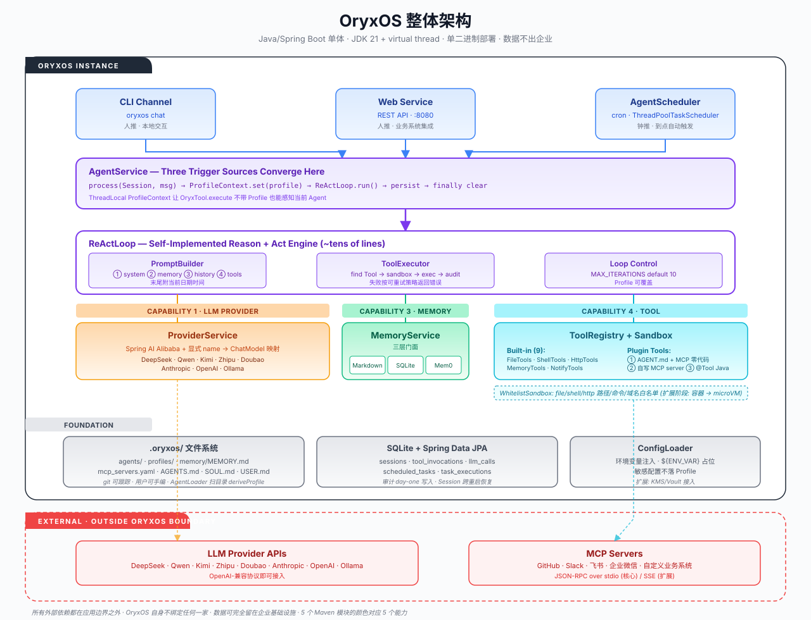

# OryxOS

> **An enterprise Agent OS written in Java.** A private, auditable, unified runtime for running multiple business AI Agents on your own infrastructure.

🌐 **Website**: [oryxos.dev](https://oryxos.dev) (sources in [`website/`](website/) · built with VitePress · bilingual EN+中文)

[](LICENSE)
[](https://openjdk.org/projects/jdk/21/)
[](https://spring.io/projects/spring-boot)
[](#roadmap)
[](#project-structure)

**OryxOS** is an enterprise-grade **Agent Operating System** built in Java on Spring Boot. Install it on your own Kubernetes cluster or servers, run multiple business Agents (operations, customer service, HR, sales, knowledge management) on top of it, and share a single set of capabilities: LLM provider routing, ReAct reasoning loop, three-layer memory, plugin tools with sandboxing, and a REST API for system integration.

**Data never leaves your infrastructure. No cloud lock-in. Open source under MIT.**

---

## Table of Contents

- [Why OryxOS?](#why-oryxos)
- [Five Core Capabilities](#five-core-capabilities)
- [Quick Start](#quick-start)
- [Defining an Agent](#defining-an-agent)
- [Architecture](#architecture)
- [Comparison](#comparison)
- [Documentation](#documentation)
- [Tech Stack](#tech-stack)
- [Project Structure](#project-structure)
- [Roadmap](#roadmap)
- [Spec-Kit Deliverables](#speckit-deliverables)
- [Contributing](#contributing)
- [Community & Support](#community--support)
- [License](#license)
- [Acknowledgments](#acknowledgments)

---

## Why OryxOS?

The open-source Agent OS space has two strong incumbents — **OpenClaw** (Node.js, consumer-focused) and **Hermes Agent** (Python, team-focused). Both prove the model works. But neither targets the segment that needs it most: **regulated enterprises** (banks, government, telecom, energy, healthcare) who must run agents **on their own infrastructure**, **fully auditable**, and **aligned with their existing Java tech stack**.

**OryxOS fills the Java gap in the Agent OS layer.** It brings proven Agent OS design — multi-channel routing, three-layer memory, Skill system, MCP-based tool calling, single-binary deployment — into the Java/Spring ecosystem, where the surrounding enterprise infrastructure (Nacos, Sentinel, SkyWalking, Arthas, Prometheus+Grafana) is already complete.

Read [docs/IndustryResearch.md](docs/IndustryResearch.md) for the full market analysis.

---

## Five Core Capabilities

| # | Capability | What it does |
|---|-----------|--------------|
| **1** | **LLM Provider abstraction** | Unified interface over DeepSeek, Qwen, Kimi, Zhipu, Doubao, Anthropic, OpenAI, and Ollama. Switch models at runtime with no lock-in. Built on Spring AI Alibaba. |
| **2** | **ReAct loop** | Self-implemented Reason+Act engine (~tens of lines of Java). Agent autonomously decides when to call tools and continues until done or `max_iterations` is reached. |
| **3** | **Three-layer memory** | Session memory + long-term `MEMORY.md` + pluggable backends (Markdown / SQLite / self-hosted Mem0). Agents remember user preferences across conversations. |
| **4** | **Plugin tools + sandbox** | 9 built-in tools (file, shell, HTTP, memory, notify). Three extension tiers: zero-code `AGENT.md` + MCP / lightweight custom MCP server / heavyweight `@Tool` Java beans. App-layer whitelist sandbox. |
| **5** | **REST API** | 10 production endpoints for sessions, agent invocation, profile/memory/tool discovery, and health. Spring MVC + Java 21 virtual threads. |

Plus: **three trigger sources** — CLI (human-push), REST API (human-push), `AgentScheduler` cron (clock-push) — all converging on the same `AgentService` so the engine doesn't care who started it.

Read [docs/DemandAnalysis.md](docs/DemandAnalysis.md) for the full functional spec.

---

## Quick Start

> ⚠️ **Status: Core Stage (under construction).** OryxOS 1.0 is being built in 4 weeks × 3 hours = 12 hours of focused development, broken into 5 user stories. The runtime kernel target is the three end-to-end daily-running demos described below.

### What you'll be able to do once 1.0 ships

```bash
# 1. Initialize a workspace
oryxos init

# 2. Drop a new agent as a directory (zero Java code)
mkdir -p .oryxos/agents/daily-weather
# ... write AGENT.md (frontmatter + task instructions) ...

# 3. Chat with it interactively
oryxos chat --profile daily-weather

# 4. Or expose the whole thing as a REST API
oryxos serve    # listens on :8080

# 5. Or run scheduled tasks (clock-push)
oryxos gateway  # CLI + API + scheduled jobs all together
```

### The three demos that prove it works

| Demo | Trigger | What runs | Capabilities exercised |
|------|---------|-----------|------------------------|
| **Daily Weather** | `AgentScheduler` 08:00 | Agent fetches weather via HTTP tool, generates outfit advice, pushes to enterprise IM | LLM + ReAct + HTTP Tool + NotifyTools + Sandbox + Scheduler |
| **Daily Tech Digest** | `AgentScheduler` 09:00 | Agent reads sub-instruction on demand, calls news MCP, drafts digest reflecting user's prior preferences (from `MEMORY.md`), pushes | Memory + MCP + read_file-on-demand + NotifyTools + Scheduler |
| **Daily GitHub Digest** | `AgentScheduler` 09:30 | Agent runs bundled Python script via `shell`, summarizes JSON output, pushes | Shell Tool + script sandbox boundary + Memory + NotifyTools + Scheduler |

Every demo runs **clock-push** but also supports **manual trigger** (`oryxos chat` or `POST /agents/{name}/invoke`) — proving all three trigger paths share the same `AgentService` chain.

Read [docs/TechnicalSolution.md §12](docs/TechnicalSolution.md) for demo flow details.

---

## Defining an Agent

One of OryxOS's key design choices is that **business users define agents by writing files, not Java code**:

```
.oryxos/agents/<name>/
├── AGENT.md            # frontmatter = profile, body = task instructions
├── skills/             # optional sub-instructions (read on-demand by the model)
│   └── digest-format.md
├── scripts/            # optional scripts (run via shell tool)
│   └── github_trending.py
└── REFERENCE.md        # optional reference material
```

The `AgentLoader` scans `.oryxos/agents/` at startup, derives a `Profile` from each `AGENT.md`'s frontmatter, and registers it. **`ContextLoader` injects the body into the system prompt** (along with Bootstrap files `AGENTS.md`/`SOUL.md`/`USER.md`). Sub-instructions and scripts are **not pre-loaded** — the model fetches them on demand via the built-in `read_file` / `shell` tools. This is **progressive disclosure inside one agent**, borrowed from Anthropic's Agent Skills format but interpreted as "one agent = one directory."

A minimal `AGENT.md`:

```markdown
---
name: daily-weather
description: Push daily weather and outfit advice to the team
provider:
  name: deepseek
  model: deepseek-chat
tools:
  - http_get
  - notify
notify_channels:
  - type: webhook
    config:
      url: ${WEATHER_NOTIFY_URL}
schedules:
  - id: morning-weather
    cron: "0 0 8 * * *"
    zone: Asia/Shanghai
    message: "查一下今天上海的天气，生成穿搭建议并推送"
settings:
  max_iterations: 10
---

# Daily Weather Agent

You are a daily weather assistant. Each morning:

1. Fetch today's weather for Shanghai via `http_get` (whitelisted domains only).
2. Based on temperature and conditions, generate concise outfit advice.
3. Push the advice to the team channel via `notify`.

Do not invent data. If the API fails, report the failure verbatim.
```

That's it. No Java. No SDK. No deployment pipeline.

---

## Architecture

OryxOS is a single Spring Boot 3.x application on JDK 21, packaged as a single executable JAR (or, in the extension stage, a GraalVM Native Image). All paths converge on one engine.



The architecture has four layers inside one JVM process:

- **Entry Layer** — CLI Channel, Web Service, AgentScheduler. Three trigger sources (human-push ×2, clock-push ×1) — all converge on `AgentService`.
- **Engine Layer** — `AgentService`, `ReActLoop`, `PromptBuilder`, `ToolExecutor`. The Reason+Act engine; `ReActLoop` doesn't care which entry point started it.
- **Capability Layer** — `ProviderService`, `MemoryService`, `ToolRegistry` + `Sandbox`. The three capabilities the engine calls into on every iteration.
- **Foundation Layer** — `.oryxos/` files, SQLite, `ConfigLoader`. User-editable workspace, audit-grade persistence, secret-safe config loading.

External dependencies (LLM provider APIs, MCP servers) sit **outside** the OryxOS boundary — OryxOS itself binds to none of them.

Read [docs/TechnicalSolution.md §2](docs/TechnicalSolution.md) for the full architectural walkthrough.

---

## Comparison

| Dimension | **OryxOS** | OpenClaw | Hermes Agent | Dify / Coze |
|-----------|-----------|----------|--------------|-------------|
| Language | **Java** | Node.js | Python | Python / TS |
| Target | **Regulated enterprise** | Consumer / small team | Team / small org | Business users |
| Deployment | **Single binary, on-prem** | On-prem | On-prem | Cloud-hosted SaaS |
| Multi-tenancy | Planned (extension) | ❌ | Partial | ✅ (SaaS) |
| SSO / RBAC | Planned (extension) | ❌ | Partial | ✅ (SaaS) |
| Audit trail | Built-in (day-one DB writes) | ❌ (CVE-prone) | Partial | ✅ (SaaS) |
| Ecosystem fit | **Java/Spring/Cloud-native** | JS/TS | Python data stack | Cross-platform |
| Java AI frameworks | Built on Spring AI Alibaba | N/A | LangChain | LangChain |
| MCP support | Client (core) + Server (extension) | ✅ | ✅ | ✅ |
| Product form | **Runtime kernel + config** | Runtime | Runtime | Visual workflow builder |

**Key positioning statement**: *Frameworks give you code; orchestrators give you flows; OryxOS gives you the runtime that hosts your agents — auditable, private, Java-native.*

Read [docs/IndustryResearch.md §5](docs/IndustryResearch.md) for the detailed positioning.

---

## Documentation

Three layers of docs:

1. 🌐 **Website**: [oryxos.dev](https://oryxos.dev) — guided tour, quick start, scenarios, FAQ. Bilingual EN + 中文. Sources in [`website/`](website/), built with VitePress.
2. 📄 **The four argument-chain files** under [`docs/`](docs/) — read these when you want the full rationale. They form a complete argumentation chain — don't read only one.

| File | Answers | Read when |
|------|---------|-----------|
| [docs/IndustryResearch.md](docs/IndustryResearch.md) | **Why** — market analysis, Java ecosystem gap | You want to understand positioning |
| [docs/DemandAnalysis.md](docs/DemandAnalysis.md) | **What** — functional spec, acceptance criteria, risks | You want to know what's in/out of scope |
| [docs/TechnicalSolution.md](docs/TechnicalSolution.md) | **How** — architecture, modules, key decisions | You're implementing or reviewing the design |
| [docs/AiProgrammingGuide.md](docs/AiProgrammingGuide.md) | **How to build** — Spec-Kit workflow, 5 user stories | You're contributing code or using AI agents to build |

For AI agent context (project memory for coding agents), see [CLAUDE.md](CLAUDE.md).

---

## Tech Stack

| Layer | Technology |
|-------|-----------|
| Runtime | **JDK 21** (virtual threads for high concurrency) |
| Framework | **Spring Boot 3.x**, Spring MVC |
| AI | **Spring AI** + **Spring AI Alibaba** (LLM connectors) |
| Reasoning | Self-implemented **ReAct loop** (Spring AI agent abstraction not used) |
| Persistence | **SQLite** + **Spring Data JPA**, plus `MEMORY.md` for long-term memory |
| CLI | **Picocli**, **SnakeYAML** (Profile YAML parsing) |
| Tool protocol | **MCP Java SDK** (Model Context Protocol) |
| Logging | **Logback** + **SLF4J** (structured JSON) |
| Observability | **Micrometer** + **Prometheus** (extension stage) |
| Build | **Maven** multi-module (9 modules) |
| Packaging | Executable fat JAR → extension stage: GraalVM Native Image |

---

## Project Structure

```
oryxos/
├── oryxos-core/         # Core abstractions: OryxTool, Session, Profile,
│                        # ContextLoader, AgentLoader, ReActLoop, PromptBuilder,
│                        # ToolExecutor, AgentService, AgentScheduler
├── oryxos-provider/     # Capability 1: ProviderService + ChatModel mapping
├── oryxos-memory/       # Capability 3: MemoryService facade +
│                        # MarkdownMemoryStore / SqliteMemoryStore / Mem0MemoryStore
├── oryxos-tool/         # Capability 4 (all-in-one): built-in 9 tools,
│                        # MCP client, ToolRegistry, Sandbox, NotifyChannelAdapter
├── oryxos-channel-cli/  # CLI Channel adapter
├── oryxos-web/          # Capability 5: 6 ApiControllers, 10 endpoints
├── oryxos-storage/      # SQLite persistence layer (JPA repositories)
├── oryxos-cli/          # Picocli entry + 12 sub-commands + ConfigLoader
├── oryxos-boot/         # Spring Boot bootstrap module
├── docs/                # The four documents above
└── CLAUDE.md            # Agent context for AI coding tools
```

---

## Roadmap

OryxOS delivery is staged. **The core stage is the runtime kernel — a foundation, not a complete enterprise product.** The differentiated governance layer (multi-tenancy, SSO, full audit, Tool Policy) is the **end state**, built on top of the core kernel.

### Phase 1 — Core Stage (in progress)

**Target**: a runnable Agent OS runtime kernel with the 5 core capabilities, demonstrated by 3 daily-running end-to-end demos.

Timeline: 4 weeks × 3 hours.

| Week | Focus | Demonstrable result |
|------|-------|--------------------|
| 1 | LLM Provider + ReAct loop | `oryxos chat` multi-turn + Agent calls HTTP tool |
| 2 | Memory + Tool system | Agent remembers preferences; calls local files + external MCP |
| 3 | Web Service | External systems invoke OryxOS via 10 REST endpoints |
| 4 | Multi-Agent + engineering | Multiple agents coexist; Session persists across restart; scheduled jobs |

### Phase 2 — Extension Stage

Production-grade capabilities layered on the core kernel:

- **Multi-tenancy & SSO** — SAML/OIDC, three-level tenant model, RBAC down to Agent/Tool/Skill
- **Full audit & traceability** — structured events, trace IDs, SIEM export
- **Web dashboard** — Profile management, Session browser, audit query, monitoring
- **Tool Policy** — profile-level allow/deny rules
- **Container / microVM sandbox** — namespace+cgroups+seccomp, Firecracker/Kata/gVisor
- **Vector memory** — LanceDB Java / pgvector / JVector (TBD)
- **Adaptive routing** — fallback, hedge racing, circuit breaker
- **Cluster HA** — multi-node with Nacos / ETCD

### Phase 3 — Community

Open-ended, community-driven:

- IM Channels (WeCom, Feishu, DingTalk, Slack)
- Skills marketplace (compatible with agentskills.io)
- SDKs in Java → Python → TypeScript → Go
- Visual profile editor
- Kubernetes Operator
- Multi-region deployment
- Mobile admin console

---

## Contributing

OryxOS welcomes contributions. The main development phase uses **Spec-Kit** for spec-driven development; the incremental phase uses manual prompts with Claude Code.

**Quick rules** (see [CLAUDE.md](CLAUDE.md) and [docs/AiProgrammingGuide.md](docs/AiProgrammingGuide.md) for the full set):

1. **JDK 21+ required.** No non-JDK-21 features.
2. **Self-implement the ReAct loop.** Do not use Spring AI's agent abstraction.
3. **Use Spring AI only for Provider abstraction + protocol conversion + `@Tool` schema generation. Disable its auto tool execution** — otherwise tools will be called twice.
4. **Tool-related code lives in `oryxos-tool`** — do not split into multiple modules.
5. **`AGENT.md` loading lives in `oryxos-core/ContextLoader`** — not in the tool module.
6. **Use explicit `provider name → ChatModel` mapping**, not container type scanning.
7. **Audit tables (`tool_invocations`, `llm_calls`) are written from day one** — not just logs.
8. **Do not modify `constitution.md` on your own** — escalate to maintainers.
9. **Run `/speckit.analyze` after every user story** — drift prevention is mandatory.

### Ways to contribute

- 🐛 **Bug reports** — open an issue with reproduction steps
- 💡 **Feature requests** — discuss in issues before opening a PR
- 🔧 **Pull requests** — fork, implement against the active user story, add tests, run `mvn verify`
- 📖 **Docs** — typos, clarifications, examples in `docs/`
- 🧩 **Plugins** — new MCP servers, new Provider adapters, new Tools

---

## Community & Support

- **GitHub Issues** — bug reports and feature requests
- **GitHub Discussions** — questions, design proposals, show & tell
- **Documentation** — start with [docs/](docs/)

---

## Spec-Kit Deliverables

Spec-Kit features that have landed in the repository. Each row links to the
`specs/` directory holding the `spec.md` / `plan.md` / `tasks.md` triple
generated by `/speckit-specify` / `/speckit-plan` / `/speckit-tasks`.

| Feature | Status | Spec | Implementation |
| ------- | ------ | ---- | -------------- |
| LLM Provider routing (US-1, deepseek + qwen + MiniMax) | ✅ Landed | [specs/001-llm-provider-routing/](specs/001-llm-provider-routing/) | `oryxos-provider/` |
| ReAct loop (US-2) | ✅ Landed | [specs/002-react-loop/](specs/002-react-loop/) | `oryxos-core/` |
| **CLI commands (US-3)** | ✅ **Landed** | **[specs/003-cli-commands/](specs/003-cli-commands/)** | **`oryxos-cli/`** |

> 003-cli-commands 已落地 — 12 Picocli subcommands (`init` / `status` /
> `chat` / `serve` / `gateway` / `profile` / `provider` / `tool` /
> `session` ...) implemented in [oryxos-cli/](oryxos-cli/). 26 unit tests +
> 3 smoke scripts in [scripts/cli-smoke.sh](scripts/cli-smoke.sh) cover
> FR-009 sysexits, FR-010 stderr-only error output, FR-011 zero-Spring
> workspace commands, and FR-012 must-Spring registry commands.

---

## License

OryxOS is released under the **MIT License**. See [LICENSE](LICENSE) for the full text.

---

## Acknowledgments

OryxOS stands on the shoulders of:

- **[OpenClaw](https://github.com/openclaw/openclaw)** and **[Hermes Agent](https://github.com/NousResearch/hermes-agent)** — for validating the Agent OS design philosophy
- **[Anthropic Agent Skills](https://agentskills.io)** — for the directory-based agent format (`AGENT.md` + `skills/` + `scripts/`)
- **[Model Context Protocol (MCP)](https://modelcontextprotocol.io)** — the open protocol for LLM ↔ tool integration
- **[Spring AI](https://docs.spring.io/spring-ai)** and **[Spring AI Alibaba](https://java2ai.com)** — for LLM provider abstraction and the Chinese LLM connector ecosystem
- The **Java/Spring Cloud ecosystem** — Nacos, Sentinel, SkyWalking, Arthas, Prometheus+Grafana — for the enterprise infrastructure OryxOS inherits

---

<p align="center">
  <sub>Built for enterprises that need their AI agents private, auditable, and under their own control.</sub>
</p>